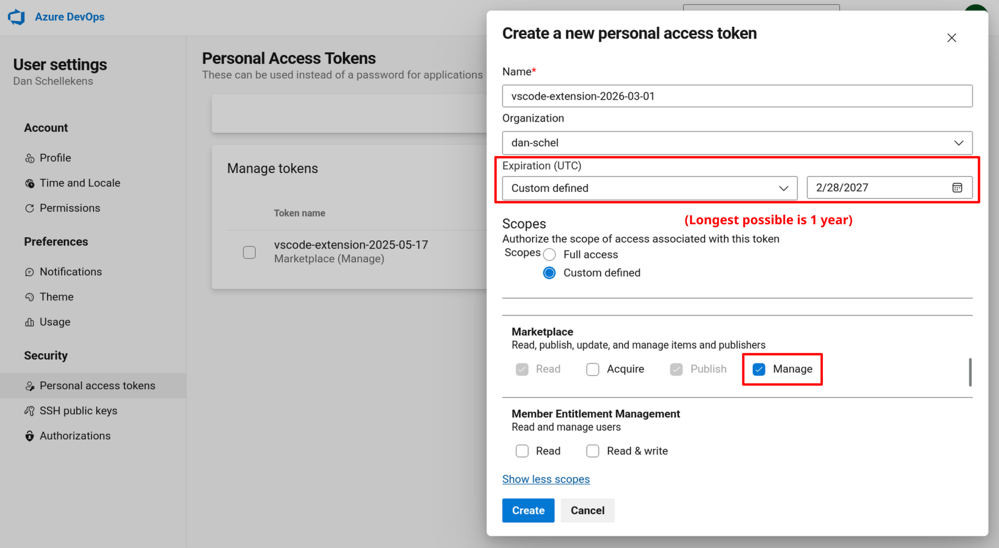

# Publishing

There is a GitHub Action to automatically publish the extension to the VSCode Marketplace and Open VSX Registry on every push to master. For it to work, the personal access tokens for both need to be up to date (see instructions below).

Pull request CI enforces that the version number is bumped for every pull request. Run `npm version patch/minor/major` to achieve this. You need to manually update the `README.md` and `CHANGELOG.md` files to add the changelog.

## VSCode Marketplace Personal Access Token

Go to `https://dev.azure.com/dan-schel/_usersSettings/tokens`.

By default it only shows active tokens, but it can be changed with the filter if you'd like.

Create a token with these permissions if there's not an active one already:

Update the `VSCE_PAT` repository secret in GitHub.

## Open VSX Registry Personal Access Token

Open VSX Registry tokens don't expire (I think?), so this step is hopefully unnecessary.

But, if needed, go to `https://open-vsx.org/user-settings/tokens` and generate a new token.

Update the `OVSX_PAT` repository secret in GitHub.
