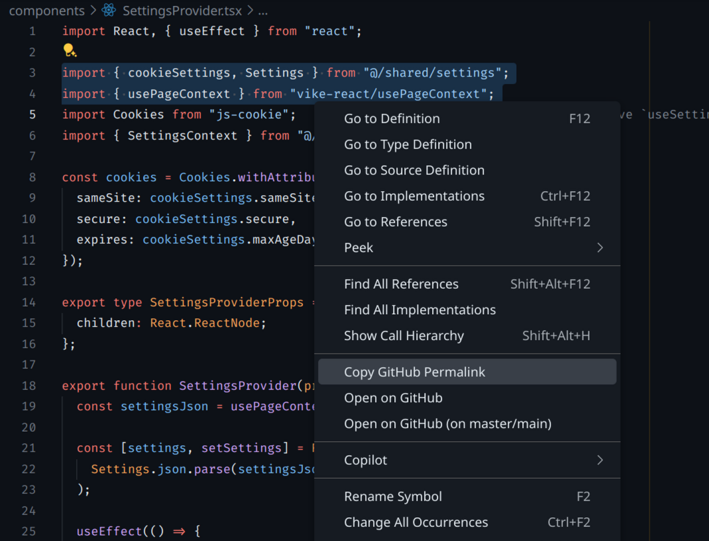

# Open On GitHub

## Features

This extension adds three commands for opening files on GitHub:

- Copy GitHub Permalink
- Open on GitHub
- Open on GitHub (on master/main)

These commands are added to the context menus for files/folders in the explorer, as well as in the editor itself.

## Release Notes

### 1.0.0

- Initial release
