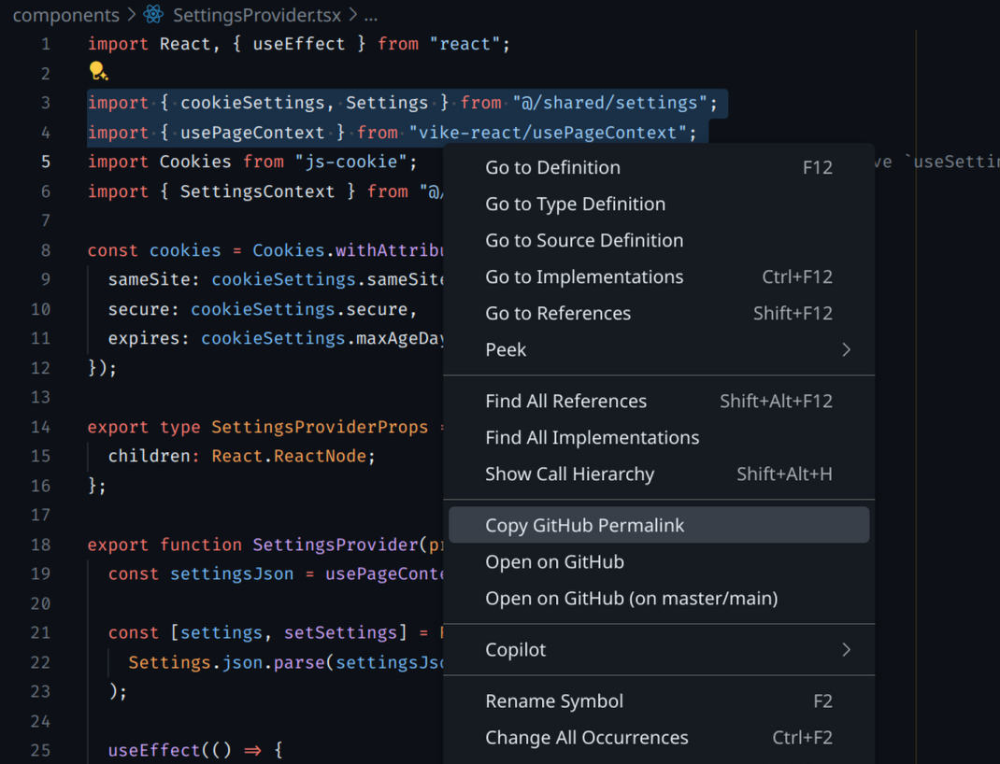

# Open On GitHub commands

A simple VS Code extension which adds commands to open files on GitHub.

## Features

This extension adds three commands for opening files on GitHub:

- Copy GitHub Permalink
- Open on GitHub
- Open on GitHub (on master/main)

These commands are added to the context menus for files/folders in the explorer, as well as in the editor itself.

## Installation

- [Install via Visual Studio Marketplace](https://marketplace.visualstudio.com/items?itemName=dan-schel.open-on-github-commands)
- [Install via Open VSX Registry](https://open-vsx.org/extension/dan-schel/open-on-github-commands)
- [Download .vsix file](https://github.com/dan-schel/vscode-open-on-github/releases)

## Release Notes

### v2.0.1

- No changes (just a version bump to test automatic release workflows)

### v2.0.0

- Update command namespaces to avoid potential conflicts with other packages
- Start publishing to Open VSX registry
- Fix case where clone URL reported by VS Code doesn't include the `.git` suffix

### v1.0.0

- Initial release
